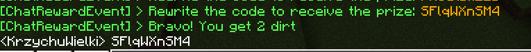
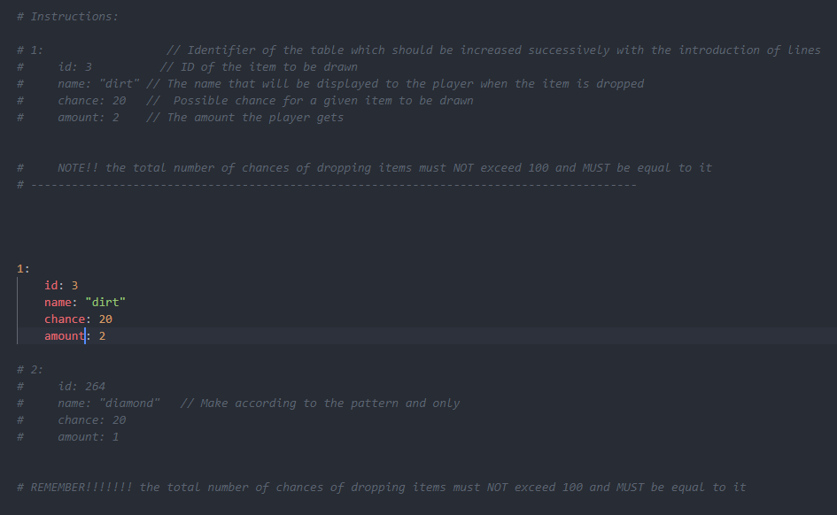
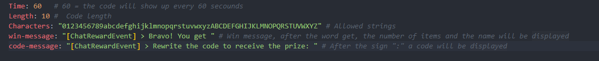

# ChatRewardEvent - for PMMP API 4.0.3

You need this plugin for API 3.26.2 instead? [CLICK HERE](https://github.com/J0k3rrWild/ChatRewardEvent)

 

## General info

This plugin rewards you for rewriting the code from chat! This is a great idea for innovation or additional competition on the server

## Overview

## Drop configuration

## Settings configuration

## Social media

